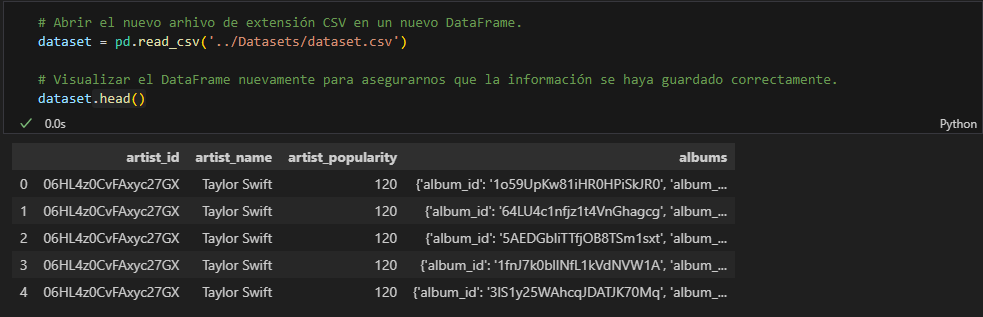
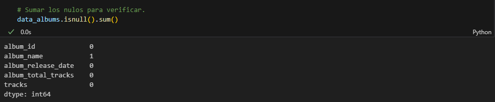
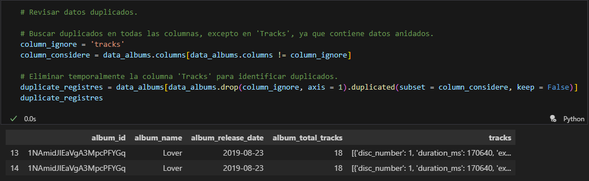
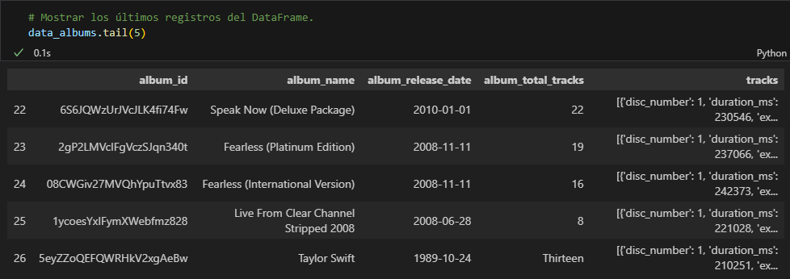
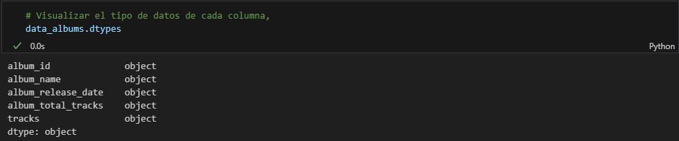
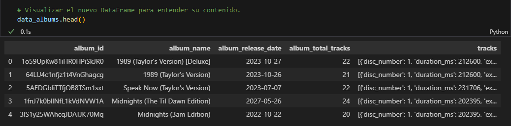
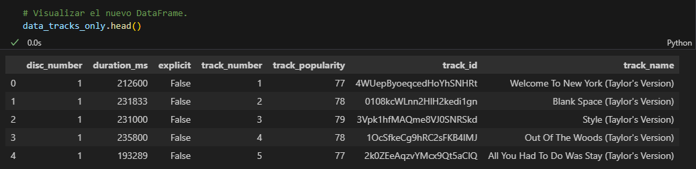
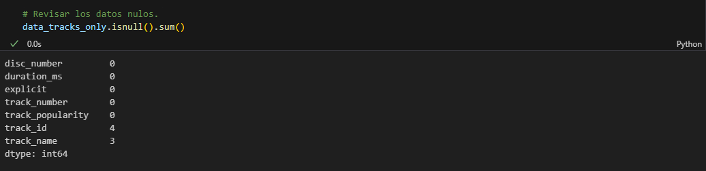
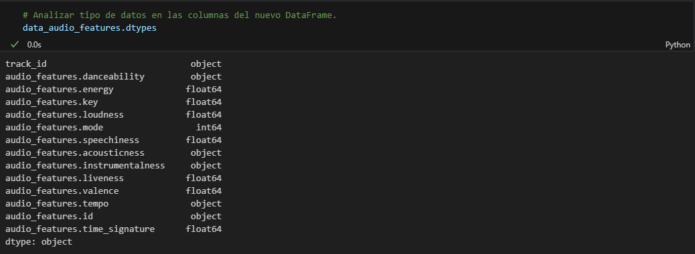
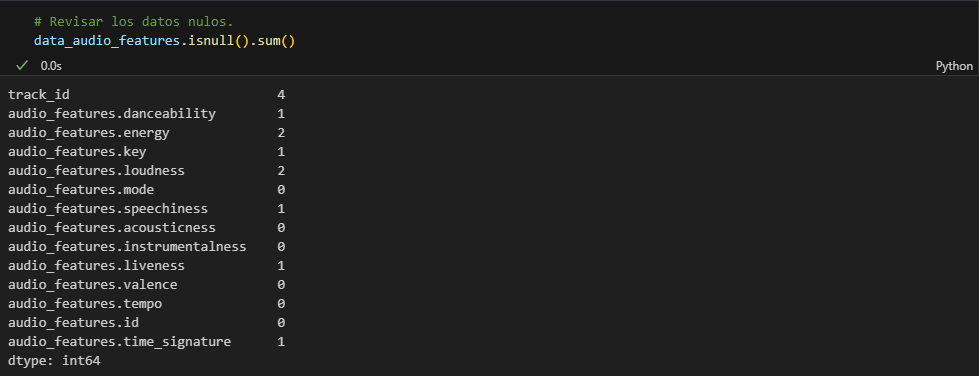

# <h1 align="center">**`Data Quality Report`**</h1>

## Analizando el Dataset

### **Paso N°1:**

En el dataset nos encontramos con los 27 discos existentes hasta la actualidad en la plataforma de Spotify de la artista musical llamada Taylor Swift.
Se puede ver el 'ID' perteneciente a cada uno de los albums, el 'Nombre del artista', la 'Popularidad del artista', y los 'Albums'. No hay anomalías visibles en estos datos, a excepción de que encontramos datos anidados en la columna de 'Albums.

### **Paso N°2:**

En el nuevo DataFrame que contiene la información desanidada de la columna 'Albums', ya podemos encontrar las primeras anomalías:
- En la columna 'Nombre del album' podemos encontrar un valor nulo, y también un valor duplicado.

- En la columna 'Total de canciones en el album' podemos encontrar un valor no numérico, y también que el tipo de dato no es el adecuado.

- Se puede visualizar que la columna 'Tracks' tiene datos anidados y se procede a desanidar para analizarse el contenido.

### **Paso N°3:**

Creamos un nuevo DataFrame que contiene la información desanidada de la columna 'Tracks', conservando sólo las columnas que hacen referencia a las canciones. Se encuentran los siguientes puntos a tener en consideración:
- La columna 'Track_ID' podría ubicarse al principio de la tabla. También en esta misma columna encontramos 4 datos faltantes.

- La columna 'Track_Name' contiene 3 datos faltantes.

### **Paso N°3:**

Creamos un nuevo DataFrame que contiene la información desanidada de la columna 'Tracks', conservando sólo las columnas que hacen referencia a los features de cada canción. Se encuentran los siguientes puntos a tener en consideración:

- Las siguientes columnas tienen el tipo de dato como "object" y debería ser de tipo "float64":
    * 'audio_features.danceability'
    * 'audio_features.acousticness'
    * 'audio_features.instrumentalness'
    * 'audio_features.tempo'

- Las siguientes columnas poseen datos faltantes:
    * 'audio_features.danceability'
    * 'audio_features.energy'
    * 'audio_features.key'
    * 'audio_features.loudness'
    * 'audio_features.speechiness'
    * 'audio_features.liveness'
    * 'audio_features.time_signature'

